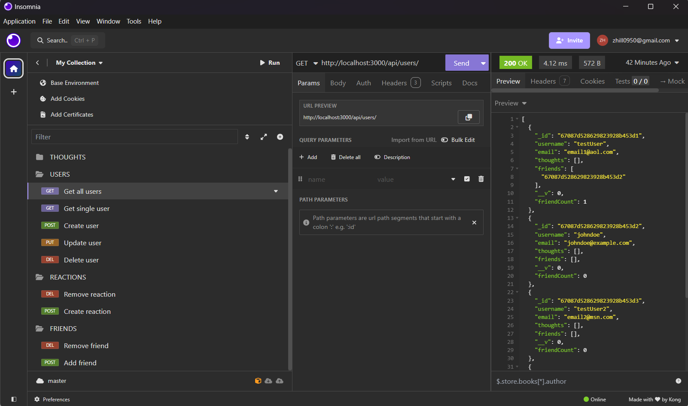

# Module-17 - Social Network API

## Description

For this challenge, I was tasked with building an API from scratch for a social network web application where users can share their thoughts, react to friends' thoughts, and create a friend list.

## Technologies Used

- Express.js
- Mongoose
- MongoDB
- Insomnia

## Getting Started

### Dependencies

- Express.js
- Mongoose

### Install

In order to run this application you will need to run the following command in your terminal:

```
npm install
```

Once you've installed the dependencies you can then run the following command:

```
npm run start
```

## Insomnia

Insomnia is a great tool for testing all of the routes in your application. It allowed me to test the following routes:

| Thoughts           | Users           | Reactions       | Friends       |
| ------------------ | --------------- | --------------- | ------------- |
| GET all thoughts   | GET all users   | DELETE reaction | DELETE friend |
| GET single thought | GET single user | POST reaction   | POST friend   |
| POST thought       | POST user       |
| PUT thought        | PUT user        |
| DELETE thought     | DELETE user     |



## Application

<p align="center">
<a href="https://drive.google.com/file/d/1_SV5B6emGr86oy1QKvNwdE3BU9v8vi3d/view">Video Walkthrough</a> | <a href="zhill0950/Module-17">GitHub Repository</a>
</p>

## Credits

\*Cameron Barfuss - helped debug

## Contact

<p align="center">
zhill0950@gmail.com | <a href="https://github.com/zhill0950">Github</a> | <a href="/">Indeed</a>
